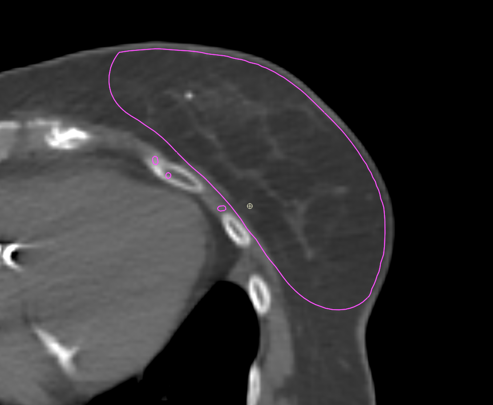
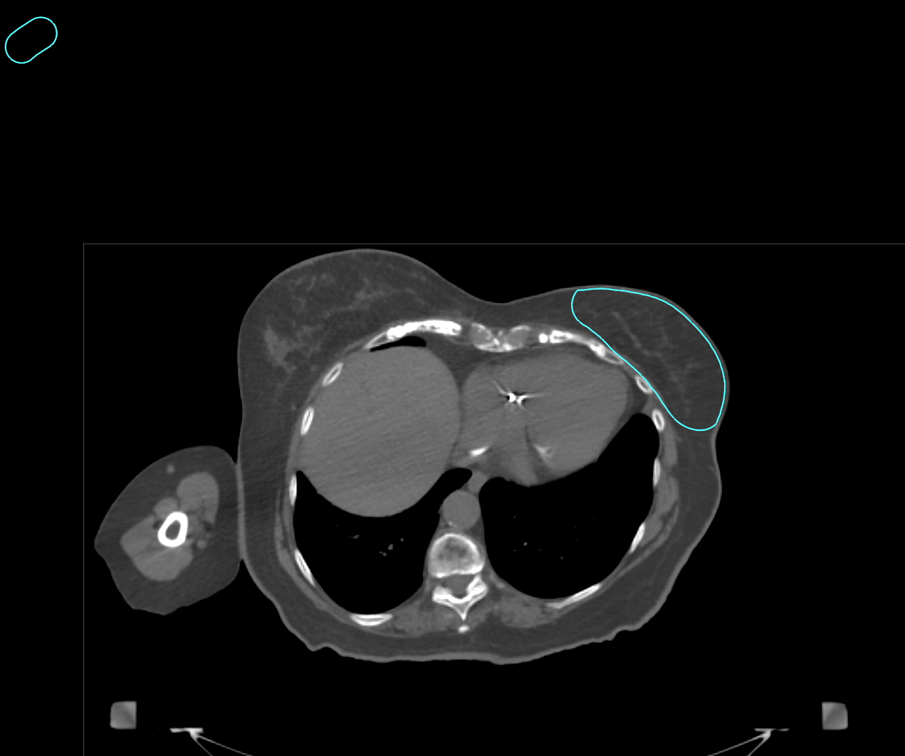
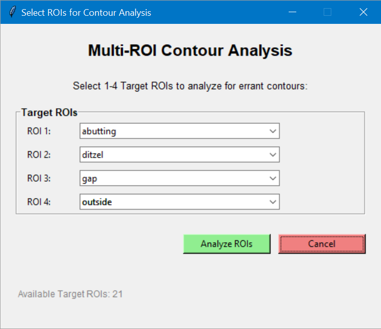

# Example: Multi-ROI Contour Analysis Workflow

## 1. Example Contour Images

### Abutting Skin

### Ditzel

### Gap

### Outside External

## 2. ROI Selection GUI

The user selects 1-4 target ROIs for analysis:

## 3. Analysis & Visualization

The analysis GUI displays contour statistics, error detection, and interactive slice viewers:

