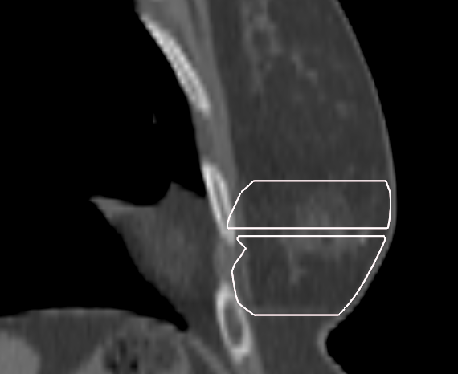

# ErrantContourCheck - Multi-ROI Contour Analysis Tool

A comprehensive quality assurance tool for detecting and visualizing errant contours in RayStation treatment planning structures.

## Overview

ErrantContourCheck analyzes multiple Regions of Interest (ROIs) simultaneously to identify potential contouring errors including:

- **Gaps**: Missing contours between slices
- **Multiple Contours**: Multiple contours on the same slice
- **Small Contours**: Contours with area < 1 mm²
- **Isolated Contours**: Contours separated from neighbors by >1× slice thickness
- **Boundary Violations**: Contours abutting or extending beyond the External ROI

## Example: Multi-ROI Contour Analysis Workflow

### 1. Example Contour Images

#### Abutting Skin
This is an example of a contour abutting the external. It's also _voxel based_ rather than _contour based_ as indicated by the changed name in the analysis plot.


#### Ditzel
This is an example of a contour with small _ditzels_ outside of it.


#### Gap
This is an example of a contour with a slice that wasn't contoured.


#### Outside External
This is an example of a cutout with a slice that has a contour outside of the external.


### 2. ROI Selection GUI

The user selects 1-4 target ROIs for analysis:


### 3. Analysis & Visualization

The analysis GUI displays contour statistics, error detection, and interactive slice viewers:


## File Structure

```
ErrantContourCheck/
├── src/
│   ├── __init__.py
│   ├── config.py
│   ├── utils.py
│   ├── errant_contours.py
├── ErrantContourCheck.py         # Main RayStation entrypoint
├── README.md                     # This file
├── .gitignore
```

## Workflow

1. **RayStation Connection**: Connects to current patient/case/exam
2. **ROI Selection**: User selects 1-4 ROIs of type "Ptv" via GUI
3. **Data Processing**: Extracts and processes contour data for all selected ROIs
4. **Analysis**: Calculates statistics, detects errors, and prepares visualizations
5. **Visualization**: Launches GUI with:
   - Contours per slice plots (color-coded for errors)
   - Area distribution histograms
   - Interactive slice viewers
   - Error detection banners

## Color Coding

- **Blue**: Normal contours
- **Red**: Problematic contours (small area <2mm² or outside external boundary)
- **Orange**: Isolated contours (separated by >2× slice thickness)
- **Gray**: Missing slices or external contour references

## Requirements

- RayStation
- Python 3.6+ (likely works on newer versions)
- Libraries: matplotlib, tkinter (part of the python base)